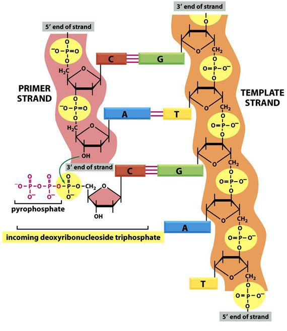
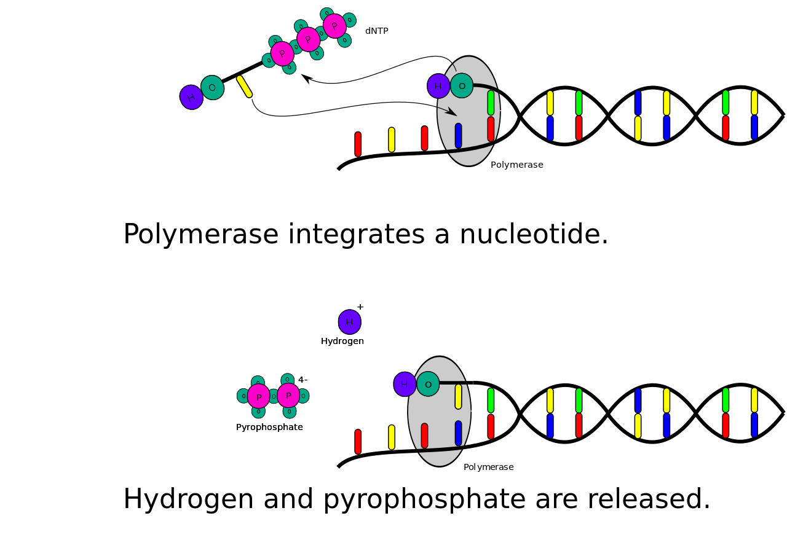
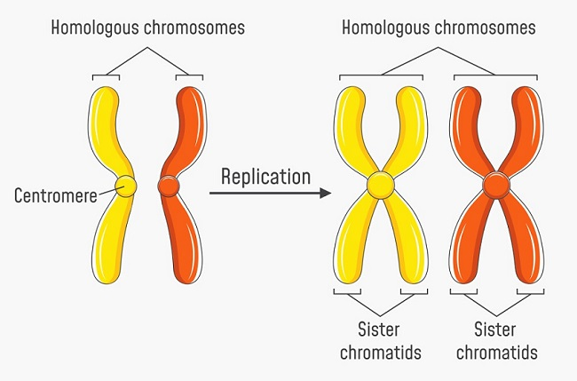
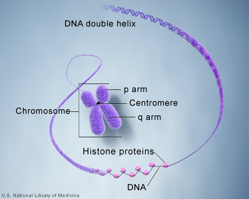
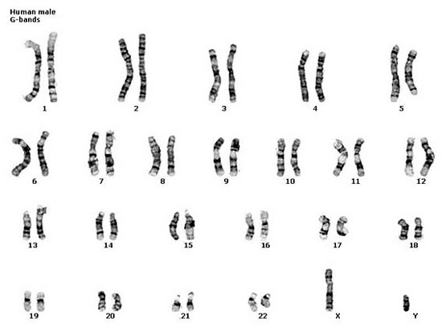
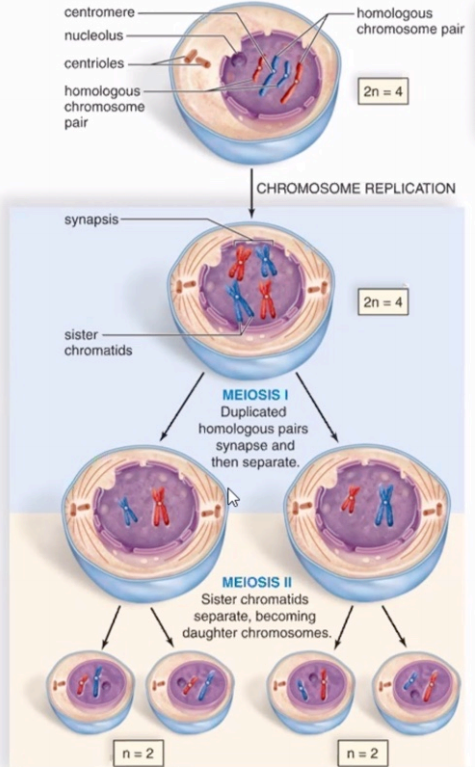
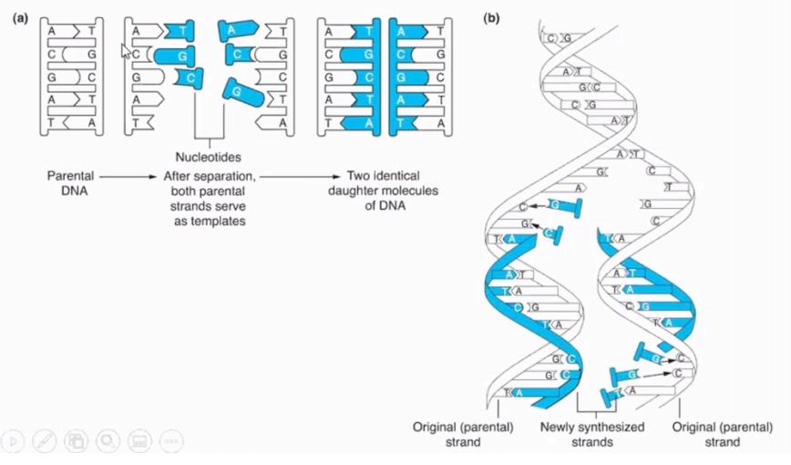

# History of DNA Research

## Cell Review

### Comparison of Prokaryotic and Eukaryotic Cells

### Review of Cell Structure

**Plasma Membrane**: Fluid, dynamic, complex double-layered barrier made of what macromolecules?

-   Roles include cell adhesion, cell-cell communication, cell shape, transportation of molecules in and out of the cell, and acting as a selective barrier.

**Cytosol**: Nutrient-rich, gel like fluid that makes up cytoplasm.

**Organelle**: Compartment where chemical reactions and cell processes take place

-   Each organelle has its own biochemical reactions
-   Allows for coordination of chemical reactions within a cell

## Evidence that DNA is the Inherited Genetic Material

In 1869, Swiss biologist **Friedrich Miescher** coined the term '**nuclein**'.

-   Cellular substance identified from the nucleus.
-   Could not be broken down by proteases.
    
    -   ***Based on this observation, would you consider it a protein?***
        -   *Since proteases were not able to break it down, it was clear that it was not a protein.*
-   *Discovered nuclein had acidic properties*
    
    -   ***What was nuclein renamed to?***
        
        -   *Nucleic Acid*
        
    -   ***What are the 2 types?***
    
        -   *Deoxyribonucleic Acid (**DNA**) and Ribonucleic Acid (**RNA**)*
    
            

British Bacteriologist Frederick Griffith — Griffith's Experiments (1928)

-   Griffith was working with two strains of the bacteria *Streptococcus pneumoniae*

    -   Virulent disease caused by smooth strains (S cells)
        -   S cells are surrounded by capsule (smooth coat) — allows evasion of the immune system
        -   Would kill mice when injected
    -   Harmless rough strain (R cells)
        -   R cells lack the capsule — easily targeted by the immune system
        -   Mice unaffected when injected

-   Did an experiment in which mice were injected with either:

    -   the S strain

    -   the R strain
-   heat killed S strain
    -   a mix of heat killed S strain and live R strain

    

**Transformation**: Process by which bacteria take in DNA from the surroundings

-   Heat treatment lysed S cells and capsule, so their DNA was released.

-   Living R cells took up S cell DNA which transformed the property of R cells so they became virulent.

-   Molecular biologists use transformation routinely to introduce genes into bacteria for cloning.

    

## Definitive Evidence that DNA is the Inherited Genetic Material

Oswald Avery, Colin MacLeod, and Maclyn McCarty (1944)

-   Homogenized mixtures of bacterial cells from large batches of *Streptococcus pneumoniae*
    -   Treated extracts with either Proteases; RNases; or DNases
    -   Did transformation experiments with the extracts
    -   Found that extracts from killed S cells treated with DNase, then mixed with living R cells did not transform the R cells because the DNA in the S cells was degraded
    
-   The experiment provided evidence that DNA is a genetic material.

-   Proved that DNA was the "transforming factor" in Griffith's experiment.

    

## DNA Structure

Building block of DNA is the nucleotide

Each nucleotide is composed of:

-   Pentose (5-carbon) sugar called deoxyribose
-   A nitrogenous base
-   Phosphate molecule

Each nucleotide contains one base:

-   **Adenine (A)**, **Thymine (T)**, **Guanine (G)** or **Cytosine (C)**

    

    

**PURE**ines

-   Pure as in gold (AU) -  **Adenine (A)**, **Guanine (G)**

Py**RIM**idines

-   Rim of a can, round, try not to get CUT - **Cytosine (C)**, **Uracil (U)**, **Thymine (T)**

    

### Discovery of the Helical Structure

Rosalind Franklin and Maurice Wilkens provided x-ray crystallography data to show helical structure in 1951.

-   Rosalind was 30 years old when making this discovery.

### Finding the Definitive Structure of DNA

James Watson and Francis Crick used data from:

-   Franklin and Wilkens
-   Chargaff base pairing

Using this information they developed a wire model that revealed definitive structure of DNA, published in *Nature* on April 25th, 1953 as "The Molecular Structure of Nucleic Acids: A Structure for Deoxyribose Nucleic Acid". They found that:

-   Nucleotides are joined together to form long strands of DNA
-   Each DNA molecule consists of two strands that join together and wrap around each other to form a double helix

**Phosphodiester bonds**: Bonds used to hold nucleotides together in a strand

***What part of an oligonucleotide and incoming nucleotide does the phosphodiester bond connect?***

-   The 3' end's OH​ group binds to the phosphate on the 5' carbon of the incoming nucleotide

-   Each strand has a polarity — a 5\` end and a 3\` end

***Polarity refers to the carbons on what part of a nucleotide?***

-   On the 5\` and 5\` carbon.

    

    Anytime a nucleotide gets incorporated into a growing strand of DNA, you get the release of a hydrogen ion and pyrophosphate.

    

The two strands of a DNA molecule are held together by **hydrogen bonds**

-   Formed between complementary base pairs
-   Adenine (A) pairs with Thymine (T)
-   Guanine (G) pairs with Cytosine (C)

The two strands are antiparallel because their polarity is reversed relative too each other.

-   DNA resembles a twisted ladder

#### Chromosome Structure

**Chromatin**: Strings of DNA wrapped around DNA-binding proteins called histones

-   State of DNA inside the nucleus when the cell is NOT dividing
-   Chromatin coils tightly forming chromosome for cell division

**Chromosomes**: tightly coiled arrangement of DNA and proteins

Most human cells have two sets (pairs) of 23 chromosomes (paternal and maternal), or 46 chromosomes total
-   Called **homologous pairs**
-   Autosomes - chromosomes 1-22
-   Sex chromosomes - chromosome pair #23
    -   X and Y chromosome

**Gametes** (sex cells):  contain a single set of 23 chromosomes (haploid number, n)

-   All other cells in the body are somatic cells

**Chromatid**: One copy of a newly replicated chromosome

-   Sister chromatids are exact replicas of each other
-   During mitosis, each sister chromatid is separated

**Centromere**: Region consisting of intertwined DNA and protein

-   Joins sister chromatids together
-   Delineates sister chromatid into 2 arms - p and q
-   Each arm of chromosome ends with a telomere

**Kinetochore**: proteins that attach chromosomes to microtubules

-   Located at centromere

**Telomere**: Highly conserved repetitive nucleotide sequence

-   Attaches chromosomes to nuclear envelope
-   Enables cells to divide without losing genes
-   During aging and cancer progression telomeres shorten
-   Ensure that the DNA is not gonna get damaged, like the aglet on a shoelace

Karyotype: way to study chromosome number and basic aspects of chromosome structure

**What would a karyotype for Trisomy 21 (Down Syndrome) looks like?**

A karyotype for down syndrome would have 3 chromosomes associated with the 21st homologous pair.

What is a gene?
-   Sequence of nucleotides that provides cells with instructions to synthesize a protein or type of RNA
-   On average, genes are 1000-4000 nucleotides long
-   Genes influence how cells, tissues, and organs appear

Define the term trait:

-   Curly hair vs. short hair, tall vs. short

-   Not all genes are templates to produce a protein
    
    -   Ex. genes involved in making tRNA
    
        

Genome: all of the DNA in an organism's cell
-   DNA contains instructions for life in the form of genes
    -   Humans have approximately 20,000 protein-coding genes
    -   Size of the human genome (haploid) is 3 billion base pairs, diploid is 6 billion base pairs

What is the study of genomics? 

-   The study of genomes.

What was the purpose of the human genome project that was completed in 2003? `answer`
-   The project started in 1990 and cost $2.7 billion (in 1991) to sequence the human genome, to allow us to locate genes. 
-   Now you can sequence a human genome for around $100.

**Which of the following statements is incorrect regarding deoxyribose and ribose?**

-   Ribose has a phosphate group on the 5` carbon.
-   Deoxyribose has a phosphate group on the 5` carbon
-   ***Deoxyribose has an OH group on the 2` carbon***
-   Ribose has an OH group on the 3` carbon.
-   All of the above.

**Which team of scientists were the first to empirically prove that DNA was the "transforming factor"?**

-   James Watson and Francis Crick
-   Friedrich Miescher and Erwin Chargaff
-   Rosalind Franklin and Maurice Wilkens
-   ***Oswald Avery, Colin MacLeod, and Maclyn McCarty***
-   None of the above

>   It has not escaped our notice that the specific pairing we have postulated immediately suggests a possible copying mechanism for the genetic material.

\- Watson and Crick, 1953 | "The Molecular Structure of Nucleic Acids: A Structure for Deoxyribose Nucleic Acid" published in *Nature* on April 25, 1953

Mitosis
-   Somatic cells divide by a process called **mitosis**
-   One cell devices to form two daughter cells
-   Each has identical copy of the parent cell DNA
-   Prior to mitosis, DNA **replication** must occur
-   Replication occurs during interphase

Meiosis
-   Sex cells divide by a process called **meiosis**
-   Parent cell divides to create 4 daughter cells
    -   Spermatic genesis leaves 4 equally viable reproductive cells
    -   Oogenesis leaves 1 viable reproductive cell and 3 polar bodies
-   Prior to meiosis, DNA **replication** must occur
-   DNA in each daughter cell is not an identical copy of the parent cell **What causes these differences?**
    -   *Crossing over* and *independent assortment*
    -   **Reductional division**: Occurs during meiosis 1, goes from diploid to haploid
-   Meiosis 1 is the reductional division; haploid cells (n)
-   Fertilized egg called zygote (2n) and divides by mitosis
-   Zygote = Complete set of 46 chromosomes

Reductional Division: Occurs during meiosis 1

-   Goes from diploid to haploid

    

Semiconservative Replication

-   DNA replication results in one original (parental) DNA strand and one newly synthesized DNA strand

    

1.  4.  