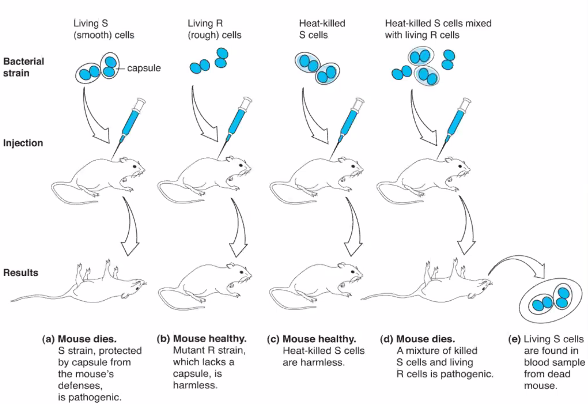
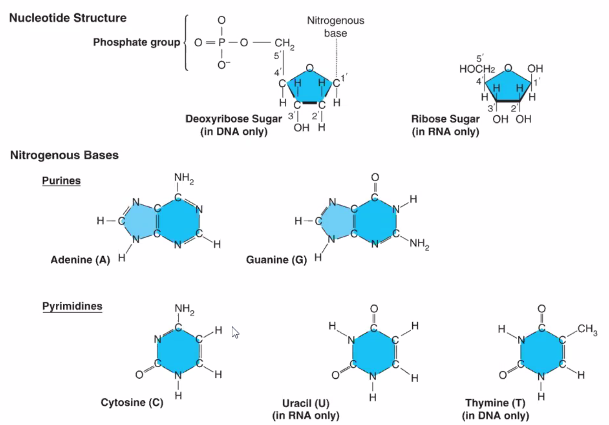

# DNA: The Molecule of Life

## Comparison of Prokaryotic and Eukaryotic Cells

## Evidence that DNA is the Inherited Genetic Material

1869, Swiss biologist Fredrich Miescher: 'nuclein'

-   Cellular substance identified from the nucleus
-   Could not be broken down by proteases
    -   *Based on this observation, would you consider it a protein?*
-   Discovered nuclein had acidic properties
    -   *What was nuclein renamed to?*
        -   Nucleic Acid
    -   *What are the 2 types?*

British bacteriologist Frederick Griffith

-   Griffith's Experiments (1928)

    -   Two strains of bacteria (Streptococcus pneumoniae)

        -   Virulent disease caused by smooth strains (S cells)
            -   S cells are surrounded by capsule (smooth coat)
        -   Harmless rough strain (R cells)
            -   R cells lack the capsule

    -   Did an experiment in which mice were injected with either:

        -   S strain

        -   R strain

        -   Heat killed S strain

        -   Mix of heat killed S strain and live R strain

            

    -   **Transformation**: Process by which bacteria take in DNA from the surroundings

        -   Heat treatment lysed S cells and capsule, so DNA was released

## Definitive Evidence that DNA is the Inherited Genetic Material

-   Oswald Avery, Colin MacLeod, and Maclyn McCarty (1944)
-   Homogenized mixtures of bacterial cells from large batches of Streptococcus pneumoniae
    -   Treated extracts with either Proteases, RNases, or DNases
    -   Did transformation experiments with the extracts
    -   Found that extracts from killed S cells treated with DNase mixed with living R cells did not transform because DNA in S cells was degraded
-   The experiment provided evidence that DNA is a genetic material
-   Proved that DNA was the "transforming factor" in Griffith's experiment

## DNA Structure

-   Building block of DNA is the nucleotide

-   Each nucleotide is composed of:

    -   Pentose (5-carbon) sugar called deoxyribose
    -   A nitrogenous base
    -   Phosphate molecule

-   Each nucleotide contains one base:

    -   **Adenine (A)**, **Thymine (T)**, **Guanine (G)** or **Cytosine (C)**

        

        

        -   **PURE**ines

            -   Pure as in gold (AU) -  **Adenine (A)**, **Guanine (G)**

        -   Py**RIM**idines

            -   Rim of a can, round, try not to get CUT - **Cytosine (C)**, **Uracil (U)**, **Thymine (T)**

                

    

    