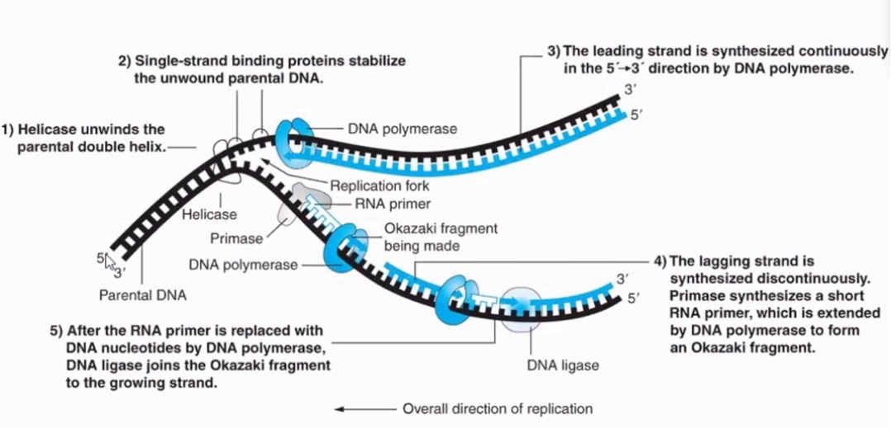

# Central Dogma

## DNA Replication

Steps in DNA replication

1.  Unwinding the DNA
    -   **Helicase**: Enzyme breaks the hydrogen bonds between complimentary base pairs that hold the two DNA strands together; "unzips" DNA
    -   Single strand binding (SSB) proteins bind to teach complementary strand of DNA and prevent them from base pairing and reforming a double helix
    -   Seperation of strands occurs in regions called **origins of replication**
2.  Adding RNA primers
    -   **DNA primase (Pol a)**: enzyme synthesizes RNA primers; known as an RNA polymerase
    -   Short segments of RNA 10-15 nucleotides long
    -   RNA primers start the replication process because they serve as binding sites for DNA polymerase
    -   **DNA Polymerase**: Enzyme that synthesizes new strands of DNA
3.  Copying the DNA
    -   **DNA polymerase** enzyme binds to the RNA primers
    -   Nucleotides (nucleoside triphosphate) used to synthesize complementary strands of DNA
    -   *Reads* in one direction — 3\` to 5\` direction
    -   *Works* in one direction — 5\` to 3\` direction

**What kind of bond is formed between the phosphate in one nucleotide and sugar in the previous nucleotide?**

-   DNA and RNA are composed of nucleotides that are linked to one another in a chain by chemical bonds, called **phosphodiester bonds**, between the sugar base of one nucleotide and the phosphate group of the adjacent nucleotide. 

-   Replication is continuous along the leading strand
-   Replication is discontinuous along the lagging strand

**Why is it discontinuous on the lagging strand?**

-   Short Okazaki fragments are synthesized as DNA polymerase works on the lagging strand
-   RNA primers are replaced with DNA nucleotides using DNA polymerase
-   Covalent bonds are formed between Okazaki fragments with **DNA ligase**

## RNA and Protein Synthesis

**Transcription**: Genes are copied (transcribed) from DNA code into RNA code

-   Genes need to be transcribed because DNA never leaves the nucleus but ribosomes are in the cytoplasm

**Translation**: RNA code (exact copies of genes) is read into a protein

**Central Dogma**: Explains that DNA codes for RNA, which codes for proteins

-   DNA -> RNA -> Protein

Through production of RNA and protein synthesis DNA controls properties of the cell and its traits.

### Transcription

-   Occurs in segments of chromosomes that contain *genes*

**RNA polymerase**: Binds to a **promoter** region

-   Unwinds DNA helix
-   Copies "works" one strand of DNA into RNA
-   **Template strand** is utilized (transcribed) 3\`-5\`

**Transcription Factor** (TF): Are DNA binding proteins that can bind to promoters

-   Help RNA polymerase find the promoter
-   Can sped up or stop transcription

**Enhancers**: Are DNA nucleotides that play a role in transcription

-   Regulatory sequences; bind to regulatory proteins (**activators**)

    

RNA polymerase binds to promoter, it unwinds a region of DNA to separate the 2 strands.

RNA polymerase copies template DNA in a 5\` to 3\` direction into RNA.

-   At the end of the gene, RNA polymerase encounters the termination sequence which creates a hairpin loop at the end of RNA.

-   RNA polymerase and newly formed strands of RNA are released from the DNA molecule.

-   RNA strand is called a **messenger RNA (pre-mRNA)**

-   Multiple copies of mRNA are transcribed from each gene during transcription. 

    

    

    

    

    

**Which of the following best described the flow of information regarding the Central Dogma?**

-   RNA → DNA → Protein
-   Protein → RNA → DNA
-   **DNA → RNA → Protein**
-   DNA → Protein → RNA

mRNA is not the only type of RNA that gets transcribed.

**Name 2 other types of RNA that are produced by transcription.**

-   Transfer RNA (tRNA)
-   Ribosomal RNA (rRNA)

**Do these 2 types of RNA carry information that directly codes for the synthesis of a protein?**

-   They don't, only mRNA contains that information.

New class of non-protein coding RNA: RNAi

-   Stands for interfering RNA

### Types of RNA

**mRNA** - copy of gene (acts as messenger by carrying genetic code from nucleus to cytoplasm where info is read into protein)

**tRNA** - molecules that transport amino acids to ribosomes during protein synthesis

**rRNA** - short single stranded RNA molecules that are components of ribosomes

Ribosomes - **what is their function?**

-   Protein synthesis

### mRNA Processing (post-transcriptional modifications)

Initial mRNA produced is the **primary transcript (pre-mRNA)**

-   Immature and not fully functional

Three modifications necessary for protein synthesis (in nucleus):

1.  **RNA Splicing**: Splice out DNA not coding for proteins (**introns**)
    -   Retain the protein coding sequence of the gene (**exons**)
    -   Alternative splicing — multiple proteins produced from single gene
2.  **3` PolyA Tail**: 100-300 adenine nucleotides added to protect mRNA from RNA degrading enzymes
    -   Increase its stability and availability for translation
3.  **Addition of a 5` Cap**: Guanine base containing a methyl group that allows for ribosome recognition 

### How is mRNA read?

**Genetic Code** — universal language of genetics used by virtually all living organisms

-   Works in three nucleotide units of MRNA called **codons**
-   Each codon codes for a single amino acid
-   One amino acid may be coded for by more than one codon
    -   64 codons and only 20 amino acids (degenerate code)
-   Start codon (AUG) codes for Met, starting point for translation
-   Stop codons — UGA, UAA, UAG — do not code for amino acids but signal the end of translation

**Read the genetic code and state which amino acid has the most codons, and which has the least amount of redundancy.**

-   The the amino acids with the most codons are: 

    -   **Arginine (Arg)** — CGU, CGC, CGA, CGG, AGA, AGG
    -   **Serine (Ser)** — UCU, UCA, UCC, UCG, AGU, AGC
    -   **Leucine (Leu)** — CUU, CUC, CUA, CUG, UUA, UUG

-   The following amino acid with the least codons is:

    -   **Methionine (Met)** — AUG

        

### Ribosomes and tRNA Molecules

**Ribosomes**: Aggregates containing rRNA and protein

-   Ribosome contains 2 subunits: small (18S) and large (28S)
-   Associate to form 2 grooves A (aminoacy) and P (peptidyl) site into which tRNA molecules bind
-   E site where tRNA molecules leave the ribosome

**tRNA**: Small molecules that fold into a cloverleaf structure

-   Has a site for amino acid attachment by aminoacyl tRNA synthetase enzyme
    -   Attaches at the 3` end
-   Aminoacyl "charged" tRNA bind to the A site of the ribosome
-   Opposite end of tRNA is anticodon
-   Each tRNA anticodon binds to its complementary codon

**Which of the following is a start codon?**

-   UAA
-   UAG
-   UGA
-   **AUG**
-   None of the above

 

### Stages of Translation

1.  **Initiation**: Is the recruitment of ribosome to mRNA and recognition of the start codon
2.  **Elongation**: Is the stepwise addition of amino acids to the growing protein chain
3.  **Termination**: Is the process by which a completed polypeptide and mRNA is released from the ribosome

#### Initiation

-   Initiation protein factors around the start codon help guide the small ribosome subunit to the mRNA
-   Small subunit binds to the 5\` end of the mRNA by the recognition of the 5\` Cap
-   Small ribosome subunit moves along the mRNA until the start codon is found
-   Small subunit waits for correct tRNA (initiator tRNA)
-   Now the large and small subunits bind to form the complex containing:
    -   mRNA
    -   Initiation Factors
    -   Small subunit
    -   Initiator tRNA

#### Elongation

-   tRNAs carrying the correct amino acid enters the ribosome at the A site, one at a time, as the mRNA code is read.
-   **Peptidyl Transferase** catalyzes formation of peptide bond between 2 AA's attached to their tRNAs.
-   **Translocation Phase**: Ribosome shifts so tRNA and protein move into P site.

#### Stages of Translation

